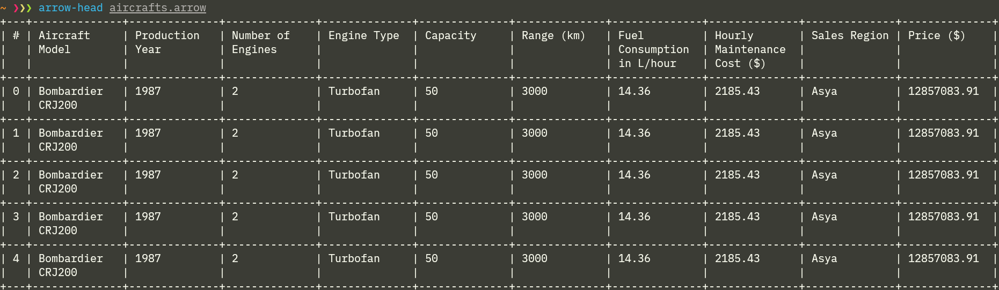
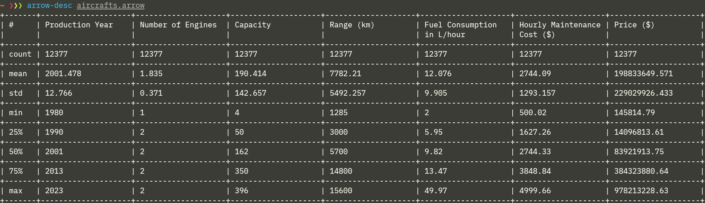
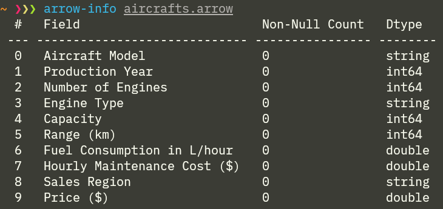

# CLI preview of Apache Arrow files

This provides a way of previewing data in CLI similar to `head()`, `describe()`, `info()` of `pandas.DataFrame`. The following assumes that file contains only one table.

The output is formatted as table with [single-header `tabulate` lib](https://github.com/p-ranav/tabulate). Place it in `src/lib`.


## Example

Suppose you have a dataset on aircraft prices in Apache Arrow `aircrafts.arrow`:

#### See the first 5 rows:
```
arrow-head aircrafts.arrow
```
<p align="center" width="100%">
    
</p>

#### See the descriptive statistics on numerical fields:
```
arrow-desc aircrafts.arrow
```
<p align="center" width="100%">
    
</p>

#### See the list of columns, dtypes and null counts:
```
arrow-info aircrafts.arrow
```
<p align="center" width="100%">
    
</p>


## arrow-head
Write first rows of table into console.

The columns width is equal among data columns and is adjusted automatically
to fit screen entirely. However, in case of tables with a lot of columns,
this may result in very narrow columns and bad readability.

Usage:
```
arrow-head dataset.arrow
```

## arrow-desc
Compute descriptive statistics on numerical fields.

The columns width is equal among data columns and is adjusted automatically
to fit screen entirely. However, in case of tables with a lot of columns,
this may result in very narrow columns and bad readability.

Usage:
```
arrow-desc data.arrow
```

## arrow-info
List columns, dtypes and null counts

Usage:
```
arrow-info dataset.arrow
```
